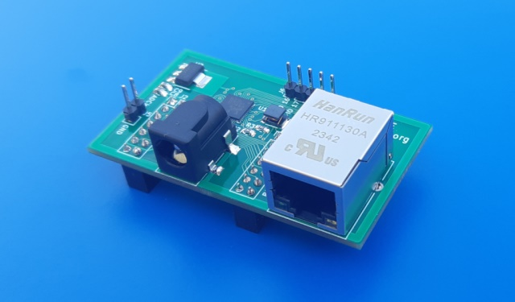
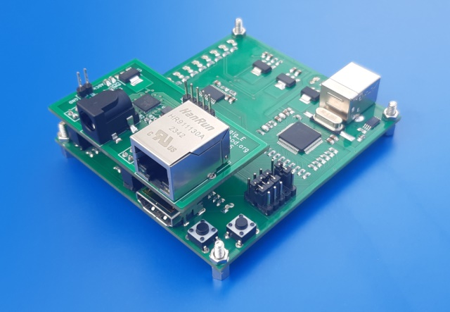

# GigEth-Shield-Board
1G Ethernet Extension PCB for Marsohod3 / Marsohod2 / Marsohod3GW2 boards

PCB Board is based on Realtek RTL8211E PHY and released in KiCAD6.
Board can be installed on top of FPGA boards: 
 - Marsohod2
 - Marsohod2bis
 - Marsohod3
 - Marsohod3bis
 - Marsohod3GW2

Ext Board setup example:

 